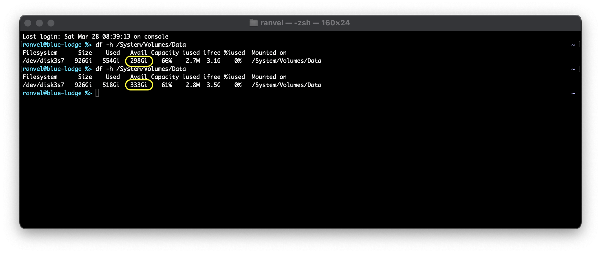

## 'clonefile' deduplication

 

# clonefile-dedup

Deduplicate files on macOS using APFS's copy-on-write `clonefile` syscall.

Unlike traditional block-level deduplication (which requires specialized filesystems like ZFS and tons of RAM), this tool works at the file level — it finds identical files and replaces duplicates with APFS clones that share storage until modified.

## Requirements

- macOS with APFS filesystem
- Python 3.10+
- Dependencies: `pip install -r requirements.txt`

## How it works

1. **Scan** — walks the directory tree collecting files above a minimum size
2. **Hash (fast pass)** — groups files by size, then computes a partial hash (first 64KB) for size-collisions
3. **Hash (full pass)** — only files with matching partial hashes get fully hashed
4. **Deduplicate** — replaces duplicates with clones of the original, preserving all metadata (permissions, timestamps, xattrs)
5. **Verify** — re-hashes each cloned file to confirm integrity

The two-phase hashing strategy means most files only get a fast 64KB read rather than a full checksum, making it practical for large drives.

## Usage

```bash
# Dry run (safe — just shows what would happen)
./clonefile-dedup.py ~/Documents

# Actually deduplicate
./clonefile-dedup.py ~/Documents --execute

# Interactive mode — confirm each operation, optionally audit in Finder
./clonefile-dedup.py ~/Documents --execute --cautious

# Customize workers and minimum file size
./clonefile-dedup.py /Volumes/Data -w 8 --min-size 1048576 --execute
```

### Options

| Flag | Description |
|------|-------------|
| `--execute` | Actually perform deduplication (default is dry-run) |
| `--cautious` | Interactive mode: confirm each clone, option to reveal in Finder |
| `-w, --workers N` | Number of parallel workers (default: CPU count) |
| `--min-size N` | Minimum file size in bytes (default: 1024) |
| `--no-verify` | Skip hash verification after cloning (faster but riskier) |
| `-q, --quiet` | Minimal output |

## Cautious mode

If you're nervous about running this on important data (you should be! back up first!), `--cautious` mode lets you:

- Review each proposed clone operation before it happens
- Press `f` after each clone to reveal the file in Finder for inspection
- Skip individual files with `n`, or approve all remaining with `a`
- Bail out at any time with `q`

## ⚠️ Warnings

- **Back up your data first.** This tool modifies files in place.
- **APFS only.** The `clonefile` syscall won't work on HFS+, FAT, or network drives.
- **Spotlight metadata may complain.** If you deduplicate indexed directories, Spotlight's internal files may show verification errors — this is expected.
- **Test on a small directory first.** Run a dry-run, then `--execute --cautious` on a test folder before unleashing it on your whole drive.

## License

BSD 2-Clause — see LICENSE file. 

Let me know how it works out for you! 
Mastodon: @ranvel@hachyderm.io